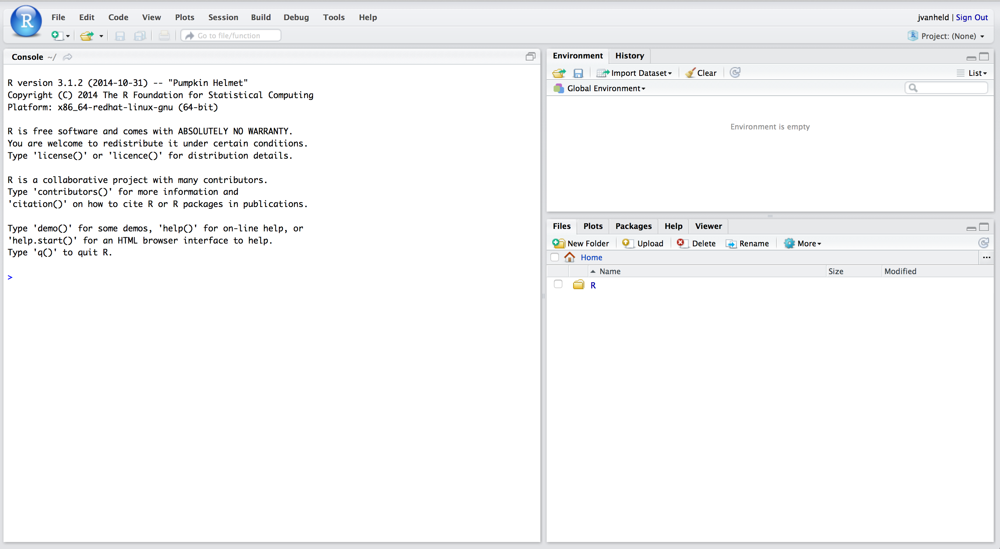

## Resources

| Resource | URL |
|----------|-----|
| **RStudio** | [https://www.rstudio.com/](https://www.rstudio.com/) |
| **IFB cloud** | [http://cloud.france-bioinformatique.fr/](http://cloud.france-bioinformatique.fr/) |
| **RStudio VM server** at IFB cloud | [http://192.54.201.140/](http://192.54.201.140/) |

The RStudio VM server is available for today's practical only. 
User logins and passwords will be given at course. 

## Opening RStudio

1. Paste a post-it on the top of your laptop screen.
2. If RStudio is installed on your laptop, just open it
3. Otherwise, 
     - Open a connection to  **RStudio VM server** at IFB cloud [http://192.54.201.140/](http://192.54.201.140/)
     - Enter your login and password (given during the course)
4. Once you see the RStudio window (snapshot next slides), remove the post-it from the top of your laptop screen.

## RStudio environment

<small>

</small>

## Going further

You can now run the tutorial **First steps with R** 
[[html](../01_first_steps_with_R/01_first_steps_with_R.html)]
[[pdf](../01_first_steps_with_R/01_first_steps_with_R.pdf)]
