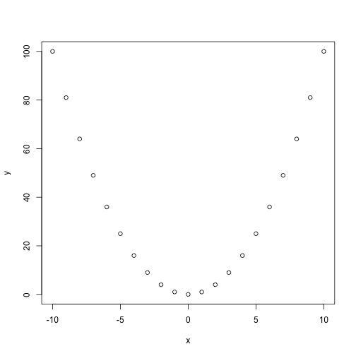
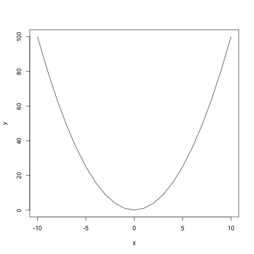
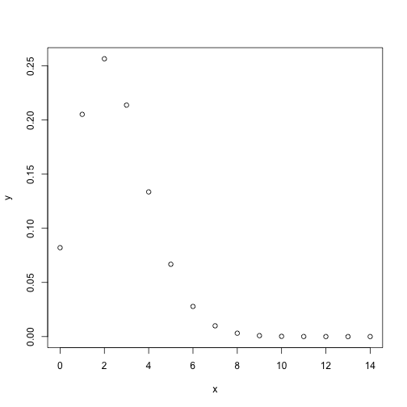
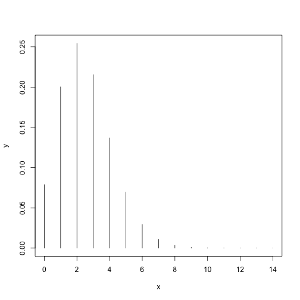
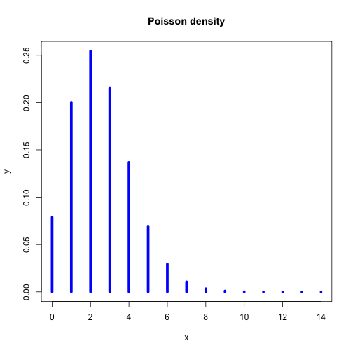
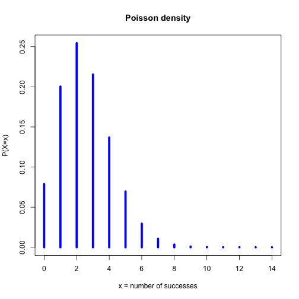
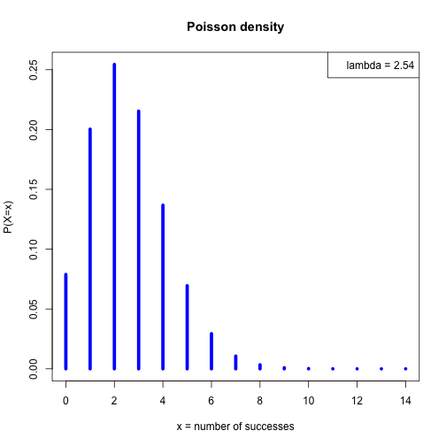

 First steps with R
========================================================
author: Jacques van Helden
date: 2015-09-30

Scope
========================================================

In this session we will explore basic manipulations of variables.

- Assigning a value to a variable
- Basic operations on numbers

Slide With Code
========================================================

**Convention**: 

- Gray boxes: commands to type in RStudio **Console** (bottom-left panel).
- White boxes: the result you should obtain.

**Example:** create a variable named ***a***, assign the value ***27*** to this variable, and ***print*** the result. 


```r
a <- 27
print(a)
```

```
[1] 27
```

Vectors of values
========================================================

The simplest data structure in R is a vector.
In the previous example, the variable ***a*** was actually a vector with a single value.

**Example:** create a variable named  ***three.numbers***, and initialize it with a vector with values ***27***, ***12*** and ***3000***.

**Tips:**
- variable names can comprize several parts, separated by dots.
- the function ***`c()`*** combines several values into a vector


```r
three.numbers <- c(27,12,3000)
print(three.numbers)
```

```
[1]   27   12 3000
```


Series
========================================================

The simple way to create a series of numbers.
The column operator permits to generate all integer values between two limits.


```r
x <- 0:14
print(x)
```

```
 [1]  0  1  2  3  4  5  6  7  8  9 10 11 12 13 14
```

Computing with vectors
========================================================

**R** handles vectors in a very convenient way. 
An operation on a vector applies to all its elements.


```r
x <- 1:10 # Define a series from 1 to 10
print(x)
```

```
 [1]  1  2  3  4  5  6  7  8  9 10
```

```r
y <- x^2 # Compute the square of each number
print(y)
```

```
 [1]   1   4   9  16  25  36  49  64  81 100
```


Scatter plot
========================================================


```r
x <- -10:10
y <- x^2
plot(x,y)
```

 

Line plot
========================================================


```r
x <- -10:10
y <- x^2
plot(x,y, type="l")
```

 


Variables can also contain strings
========================================================


```r
# The # symbol allows to insert comments in R code

# Define  a vector named "whoami", and 
# containing two names
whoami <- c("Denis", "Siméon")
print(whoami) # Comment at the end of a line
```

```
[1] "Denis"  "Siméon"
```

String concatenation
========================================================


```r
# Define  a vector named "names", and 
# containing two names
whoami <- c("Denis", "Siméon")

# Paste the values of a vector of string 
print(paste(sep=" ", whoami[1], whoami[2]))
```

```
[1] "Denis Siméon"
```


Carl's preferred distribution
========================================================

The function **`dpois()`** computes the Poisson **density**, i.e. the probability to observe **exactly** $x$ successes in a series of independent trials with equal probability.

The Poisson distribution is defined by a single parameter: the expected number of successes $\lambda$ (read "lambda").

$$P(X=x) = \frac{e^{-\lambda}\lambda^x}{x!}$$


```r
x <- 0:14   # Define the X values from 0 to 14
y <- dpois(x, lambda = 2.5) # Poisson density
print(y) # Check the result
```

Plotting the Poisson distribution
========================================================


```r
x <- 0:14   # Define the X values from 0 to 14
y <- dpois(x, lambda = 2.5) # Poisson density
plot(x,y) # Check the result
```

 

This first plot is not very nice. Let us get some help to improve it.

Getting help for R functions
========================================================

Need help? Type **`help()`**. 


```r
help(plot)
```

A question? Type `?`


```r
?plot
```

**Result:** R displays the help message for the function `dpois()`.

Exercise: improve Poisson density plot
========================================================

1. Do not (yet) look the next slide.
2. Read the help page for the `dpois()`function.
3. draw a plot that provides a didactic illustration of the  Poisson density.

Improve the plot: type = histogram
========================================================


```r
x <- 0:14
lambda <- 2.54
y <- dpois(x, lambda)
plot(x,y, type="h")
```

 

Improve the plot: Add a title
========================================================


```r
plot(x,y, type="h", lwd=5, col="blue",
     main="Poisson density")
```

 

Improve the plot: define axis labels
========================================================


```r
plot(x,y, type="h", lwd=5, col="blue",
     main="Poisson density",
     xlab="x = number of successes",
     ylab="P(X=x)")
```

 

Improve the plot: add a legend
========================================================


```r
plot(x,y, type="h", lwd=5, col="blue",
     main="Poisson density",
     xlab="x = number of successes",
     ylab="P(X=x)")
legend("topright", paste("lambda =", lambda))
```

 


Poisson: a family of curves
========================================================

**Exercice:** explore the properties of the Poisson density function, by changing the rang of $x$ values, and the $\lambda$ parameter.


