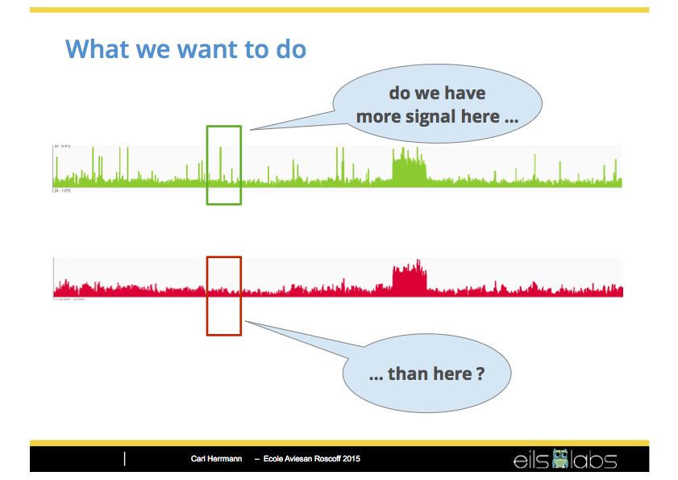

```{r setup, include=FALSE, size="huge"}
library(knitr)
## Default parameters for displaying the slides
knitr::opts_chunk$set(echo = TRUE, eval=TRUE, fig.width = 7, fig.height = 5, fig.align = "center", size = "tiny", warning = FALSE, results = TRUE, message = FALSE, comment = "")
```

# Introduction

## Peak-calling: question

<!--<center></center>-->

```{r out.width = "100%", echo=FALSE, fig.cap="**The peak calling question**. Slide from Carl Herrmann. "}

```

# Data loading

## Defining the data directory


We will first define the URL from which the data can be downloaded, by concatenating the URL fo the course with the path to our dataset.

To concatenate paths, it is *recommended* to use the **R** command `file.path()`.

<small>
```{r}
url.course <- "http://jvanheld.github.io/stats_avec_RStudio_EBA/"
url.data <- file.path(url.course, "practicals", "02_peak-calling", "data")
```
</small>


## Loading a data table

**R** enables to download data directly from the Web. 

Load counts per bin in chip sample.


```{r}
## Define URL of the ChIP file
chip.bedg.file <- file.path(url.data, "FNR_200bp.bedg")

## Load the file content in an R data.frame
chip.bedg <- read.table(chip.bedg.file)

## Set column names
names(chip.bedg) <- c("chrom", "start", "end","counts")
```

## Exploring a data frame: dim()

Before anything else, let us inspect the size of the data frame, in order to check that it was properly lodaded.

```{r}
dim(chip.bedg)
```


## Checking the n first rows: head()

The function `head()` displays the first rows of a table.

```{r}
head(chip.bedg, n = 5)
```

## Checking the n last rows: tail()

The function `tail()` displays the last rows of a table.

```{r}
tail(chip.bedg, n = 5)
```

## Viewing a table

The function `View()` displays the full table in a user-friendly mode.

```{r eval=FALSE}
View(chip.bedg)
```

## Selecting arbitrary rows

```{r}
chip.bedg[100:105,] 
```


## Selecting arbitrary columns

```{r}
chip.bedg[100:105, 2] 
chip.bedg[100:105, "start"] 
chip.bedg[100:105, c("start", "counts")] 
```

## Adding columns

We can add columns with the result of computations from other columns.

```{r}
chip.bedg$midpos <- (chip.bedg$start + chip.bedg$end)/2
head(chip.bedg)
```

# Exploring the data with basic plots

## Plotting a density profile

We can readily print a plot with the counts per bin.

```{r fig.width=7, fig.height=4, fig.align="center"}
plot(chip.bedg[, c("midpos", "counts")], type="h")
```

## Plotting a density profile

Let us improve the plot

```{r fig.width=7, fig.height=4, fig.align="center"}
plot(chip.bedg[, c("midpos", "counts")], type="h", 
     col="darkgreen", xlab="Genomic position (200bp bins)", 
     ylab= "Reads per bin",
     main="FNR ChIP-seq")
```


## Exercise: exploring the background

We already loaded the count table for the FNR ChIP counts per bin. 

The background level will be estimated by loading counts per bin in a genomic input sample.
These counts are available in the same directory a file named `input_200bp.bedg`

1. Load the counts per bin in the input sample (genome sequencing).
2. Plot the density profile of the input
3. Compare  chip-seq and input density profiles
4. Compare counts per bin between chip-seq and input

## Solution: loading the input counts per bin

```{r}
## Define URL of the input file
input.bedg.file <- file.path(url.data, "input_200bp.bedg")

## Load the file content in an R data.frame
input.bedg <- read.table(input.bedg.file)

## Set column names
names(input.bedg) <- c("chrom", "start", "end","counts")

```

## Solution: plotting the input density profile

```{r fig.width=7, fig.height=4}
## Compute middle positions per bin
input.bedg$midpos <- (input.bedg$start + input.bedg$end)/2

plot(input.bedg[, c("midpos", "counts")], type="h", 
     col="red", xlab="Genomic position (200bp bins)", 
     ylab= "Read counts",
     main="Background (genomic input)")
```

Does the background look homogeneous? How do you interpret its shape?

## Solution: comparing chip-seq and background density profiles

```{r fig.width=8, fig.height=6}
par(mfrow=c(2,1)) ## Draw two panels on top of each other
plot(chip.bedg[, c("midpos", "counts")], type="h", 
     col="darkgreen", xlab="Genomic position (200bp bins)", 
     ylab= "Reads per bin",
     main="FNR ChIP-seq")
plot(input.bedg[, c("midpos", "counts")], type="h", 
     col="red", xlab="Genomic position (200bp bins)", 
     ylab= "Reads per bin",
     main="Background (genomic input)")
par(mfrow=c(1,1)) ## Reset default mode
```

## Solution: comparing counts per bin between chip-seq and input

```{r fig.width=5, fig.height=5, fig.align="center"}
plot(input.bedg$counts, chip.bedg$counts, col="darkviolet",
     xlab="Genomic input", ylab="FNR ChIP-seq",
     main="Reads per 200bp bin")
```

## Solution: comparing counts per bin between chip-seq and input

In order to better highight the dynamic range, we can use a log-based representation

```{r fig.width=5, fig.height=5, fig.align="center"}
plot(input.bedg$counts, chip.bedg$counts, col="darkviolet",
     xlab="Genomic input", ylab="FNR ChIP-seq",
     main="Reads per 200bp bin",
     log="xy")
grid() ## add a grid
```

## Questions

- On the ChIP-seq versus input plot, how would you define  peaks ?
- Where would you place the limit between peaks and background fluctuations ?

## Exercises

1. Think about further drawing modes to improve your perception of the differences between signal and background.
2. We will formulate (together) a reasoning path to compute a p-value for each peak.


# Step-by-step walk to the significance


## Merge the two tables

```{r}
names(input.bedg)

## Merge two tables by identical values for multiple columns
count.table <- merge(chip.bedg, input.bedg, by=c("chrom", "start", "end", "midpos"), suffixes=c(".chip", ".input"))

## Check the result size
names(count.table)
```

## Checking the merge() result

```{r}
## Simplify the chromosome name
head(count.table$chrom)
count.table$chrom <- "NC_000913.2"
kable(head(count.table)) ## Display the head of the table in a 
```

## ChIP vs input counts per bin

```{r fig.width=5, fig.height=5}
max.counts <- max(count.table[, c("counts.input", "counts.chip")])
plot(x = count.table$counts.input, xlab="Input counts",
     y = count.table$counts.chip, ylab="ChIP counts",
     main="ChIP versus input counts",
     col="darkviolet", panel.first=grid())
```

Note the differences of $X$ and $Y$ scales!

## ChIP vs input counts per bin - log scales

Log scales better emphasize the dynamic range of the counts. 

```{r fig.width=5, fig.height=5}
plot(x = count.table$counts.input, xlab="Input counts per bin",
     y = count.table$counts.chip, ylab="ChIP counts per bin",
     main="ChIP versus input counts (log scale)",
     col="darkviolet", panel.first=grid(), log="xy")
```

Read the warnings. What happened?

## A tricky way to treat 0 values on log scales

- We can add a pseudo-count to avoid -Inf with 0 values.
- The usual pseudo-count is 1. I prefer 0.01 (this could be negotiated).

```{r fig.width=5, fig.height=5}
epsilon <- 0.1 ## Define a small pseudo-count
plot(x = count.table$counts.input + epsilon, 
     y = count.table$counts.chip + epsilon, 
     col="darkviolet", panel.first=grid(), log="xy")
```

## Drawing a diagonal

```{r fig.width=5, fig.height=5}
plot(x = count.table$counts.input + epsilon, xlab=paste("Input counts +", epsilon),
     y = count.table$counts.chip + epsilon,  ylab=paste("ChIP counts +", epsilon),
     col="darkviolet", panel.first=grid(), log="xy")
abline(a=0, b=1)
```

Note: most points are much below the diagonal. Why?

## ChIP/input ratios

```{r fig.width=7, fig.height=4, fig.align="center"}
count.table$ratio <- (count.table$counts.chip + 1) / (count.table$counts.input + 1)

hist(count.table$ratio)
```

The basic histogram is quite ugly. Let us fix this. 

## Ratio histogram with more breaks

```{r fig.width=7, fig.height=4, fig.align="center"}
hist(count.table$ratio, breaks=100)
```

Still very packed. 

## Ratio histogram with even more breaks

```{r fig.width=7, fig.height=4, fig.align="center"}
hist(count.table$ratio, breaks=1000)
```

A bit better but the X axis is too extended, due to outliers. 

## Ratio histogram with truncated X axis

Let us truncate the X axis (and make it explicit on X axis label).

```{r fig.width=7, fig.height=4}
count.table$log2.ratio <- log2(count.table$ratio)
hist(count.table$log2.ratio, breaks = 200, xlim=c(-5,5), col="gray", xlab="Count ratios (truncated scale)")
```

*Question: what is this "needle" at $X=0$?*

## Checking library sizes

We visibly have a problem: almost all log2 ratios are $\ll$ 0. 
Why ? Check library sizes. 

```{r}
sum(count.table$counts.chip)
sum(count.table$counts.input)
```


## Count scaling

The simplest way to "normalize" is to scale input counts by library sum.

```{r libsum_normalisation}
## Normalize input counts by library sizes
count.table$input.scaled.libsize <- count.table$counts.input * sum(count.table$counts.chip)/sum(count.table$counts.input)
```

**Note:** libsum normalisation is rudimentary and sensitive to outliers, we will see more reliable normalisation methods below. 

## Libsum normalisation result

```{r fig.width=7, fig.height=5, fig.align="center"}
## Scatter plot after libsum-based normalisation
plot(x = count.table$input.scaled.libsize + 1, 
     y = count.table$counts.chip + 1, col="darkviolet", log="xy",
     main="ChIP versus input", xlab="Scaled input counts", ylab="ChIP counts")
grid(); abline(a=0, b=1, col="black")
```


## Log-ratios

```{r fig.width=7, fig.height=4, fig.align="center"}
count.table$scaled.ratio.libsum <- (count.table$counts.chip + epsilon ) / (count.table$input.scaled.libsize + epsilon)

## Print the mean and median scaled ratios
mean(count.table$scaled.ratio.libsum)
median(count.table$scaled.ratio.libsum)

```

## Mean versus median

```{r fig.width=7, fig.height=4, fig.align="center"}
hist(count.table$scaled.ratio.libsum, breaks=2000, main="Count ratio histogram", 
     xlab="Count ratios after libsum scaling", xlim=c(0, 5), col="gray", border="gray")
abline(v=mean(count.table$scaled.ratio.libsum), col="darkgreen", lwd=3)
abline(v=median(count.table$scaled.ratio.libsum), col="brown", lwd=3, lty="dotted")
legend("topright", c("mean", "median"), col=c("darkgreen", "brown"), lwd=3, lty=c("solid", "dotted"))
```


## Print summary statistics

Let us compare the mean and median counts for ChIP and input samples. 


```{r}
summary(count.table[, c("counts.chip", "counts.input")])
```

- For the input, mean and medium are almost the same. 
- For the ChIP, we have a 10% difference. 
- This difference likely results from the "statistical outliers", i.e. our peaks. 

## Input normalization by median

Why? the median is very robust to outliers (to be discussed during the course).

```{r}
## Normalize input counts by median count
count.table$input.scaled.median <- count.table$counts.input * median(count.table$counts.chip)/median(count.table$counts.input)

count.table$scaled.ratio.median <- (count.table$counts.chip + epsilon ) / (count.table$input.scaled.median + epsilon)

## Print the mean and median scaled ratios
mean(count.table$scaled.ratio.median)
median(count.table$scaled.ratio.median)
```

## Count ratio distribution after median scaling

```{r fig.width=7, fig.height=5, fig.align="center"}
hist(count.table$scaled.ratio.median, breaks=2000, xlim=c(0, 5), xlab="Count ratios after median scaling", main="Count ratio histogram", col="gray", border="gray")
abline(v=mean(count.table$scaled.ratio.median), col="darkgreen", lwd=3)
abline(v=median(count.table$scaled.ratio.median), col="brown", lwd=3, lty="dotted")
legend("topright", c("mean", "median"), col=c("darkgreen", "brown"), lwd=3, lty=c("solid", "dotted"))
```

## Log2 fold changes

After having normalized the counts, we can use a log2 transformation. 

```{r log2.ratios}
## Add a column with log2-ratios to the count table
count.table$log2.ratios <- log2(count.table$scaled.ratio.median)
```

- the distribution becomes symmetrical
- The milestone ratio of 1 ("neutral" bins) becomes 0 after log transformation. 
- Positive values: bins enriched in the ChIP sample

    - $log2(r) = x \iff r = 2^x$
    - Two-fold enrichment: $log2(r) = 1 \iff r = 2$
    - Four-fold enrichment: $log2(r) = 2 \iff r = 4$

- Negative values: bins enriched in the ChIP sample

    - $log2(r) = -x \iff r = 1/2^x$
    - Two-fold empoverishment: $log2(r) = -1 \iff r = 1/2$
    - Four-fold empoverishment: $log2(r) = -2 \iff r = 1/4$


## Ratios versus log2(ratios)

```{r fig.width=10, fig.height=4, fig.align="center"}
par(mfrow=c(1,2))

## Plot ratio distribution
hist(count.table$scaled.ratio.median, breaks=2000, xlim=c(0, 5), xlab="Count ratios after median scaling", main="Count ratio histogram", col="gray", border="gray")
abline(v=mean(count.table$scaled.ratio.median), col="darkgreen", lwd=3)
abline(v=median(count.table$scaled.ratio.median), col="brown", lwd=3, lty="dotted")
legend("topright", c("mean", "median"), col=c("darkgreen", "brown"), lwd=3, lty=c("solid", "dotted"))

## Plot log2-ratio distribution
hist(count.table$log2.ratios, breaks=100, xlim=c(-5, 5), xlab="log2(ChIP/input)", 
     main="log2(count ratios)", col="gray", border="gray")
abline(v=mean(count.table$log2.ratios), col="darkgreen", lwd=3)
abline(v=median(count.table$log2.ratios), col="brown", lwd=3, lty="dotted")
legend("topright", c("mean", "median"), col=c("darkgreen", "brown"), lwd=3, lty=c("solid", "dotted"))
```

<!--

## MA plot

The so-called **MA plots** became popular with microarrays. 

- **M** 

    - symbolizes the log2(ratio), as computed above: $M = log2(\text{chip}/\text{input})$
    - indicates the level of count enrichment for the ChIP sample
    
- **A** 

    - stands for averaged log2 counts: $A = \frac{1}{2}(log2(chip) + log2{input})$
    - quantifies the reads associated to this bin across all samples (ChIP and input)


```{r MA_plot}
count.table$M <- 1/2*(log2(count.table$counts.chip + epsilon) + log2(count.table$input.scaled.median + epsilon))

plot(count.table$M, count.table$log2.ratio)
```
-->

## Computing the p-value

The median-scaled input counts per bin indicate the local background level, which reflects position-specific differences of DNA accessibilty to the sequencing. 

MACS relies on a local background model to estimate the expectation ($\lambda$ parameter) of a Poisson distribution. MACS uses 3 distinct window widths to estimate narrower or wider local backgrounds. This is relatively simple to compute, but for this tutorial we will apply an even simpler approach: use scaled input counts of each bin as local estimate of $\lambda$.

We can thus directly calculate the Poisson p-value. 

```{r}
count.table$pvalue <- ppois(
  q=count.table$counts.chip, 
  lambda = count.table$input.scaled.median, lower.tail = FALSE)
```

## P-value histogram

We computed a p-value for each bin separately. Before going further, it is always informative to get a  sketch of the distribution of all the p-values in our dataset. This can be achieved with a p-value histogram. 

```{r fig.width=7, fig.height=4, fig.align="center"}
hist(count.table$pvalue, breaks=20, col="grey")
```

To be discussed: 

- under the null hypothesis, what would be the expected shape for a p-value distribution ?
- what do we see in the p-value range from 0 to 0.05 ?
- what do we see in the p-value range from 0.95 to 1.00 ?


## P-value profile

By definition, P-values are comprised between 0 and 1. 

However, we are only interested by very low values. For graphical purposes, what is relevant is not to perceive differences between 0.20, 0.50 or 0.90 (all these high p-values indicate that the result is not significant), but by very small p-values, e.g. $10^{-2}$,  $10^{-5}$ or  $10^{-300}$.  

For this, p-values are usually represented on a logarithmic scale. Alternatively, p-values can be converted to -log10(p-value). 


```{r fig.width=7, fig.height=8}
par(mfrow=c(3,1))
par(mar=c(2,4,0.5,0.5))
plot(count.table$midpos, count.table$counts.chip, type='h', col="darkgreen", xlab="", ylab="counts")
plot(count.table$midpos, -log10(count.table$pvalue), type='h', col="grey", xlab="", ylab="-log10(p-value)")
par(mfrow=c(1,1))
```


## Having a look at the full result table

```{r eval=FALSE}
View(count.table)
```


## Before finishing -- keep track of your session

Tractability is an important issue in sciences. Since R and its libraries are evolving very fast, it is important to keep track of the full list of libraries used to produce a result, with the precise version of each library.  This can be done automatically with the ***R*** function `sessionInfo()`. 

```{r sessioninfo}
## Print the complete list of libraries + versions used in this session
sessionInfo()
```

